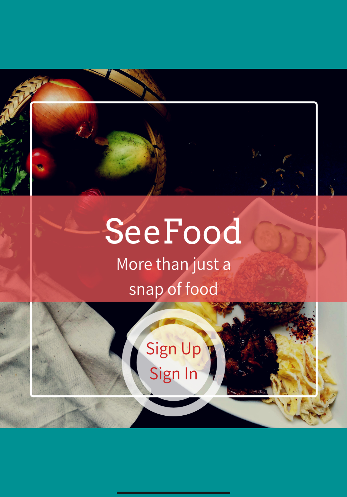
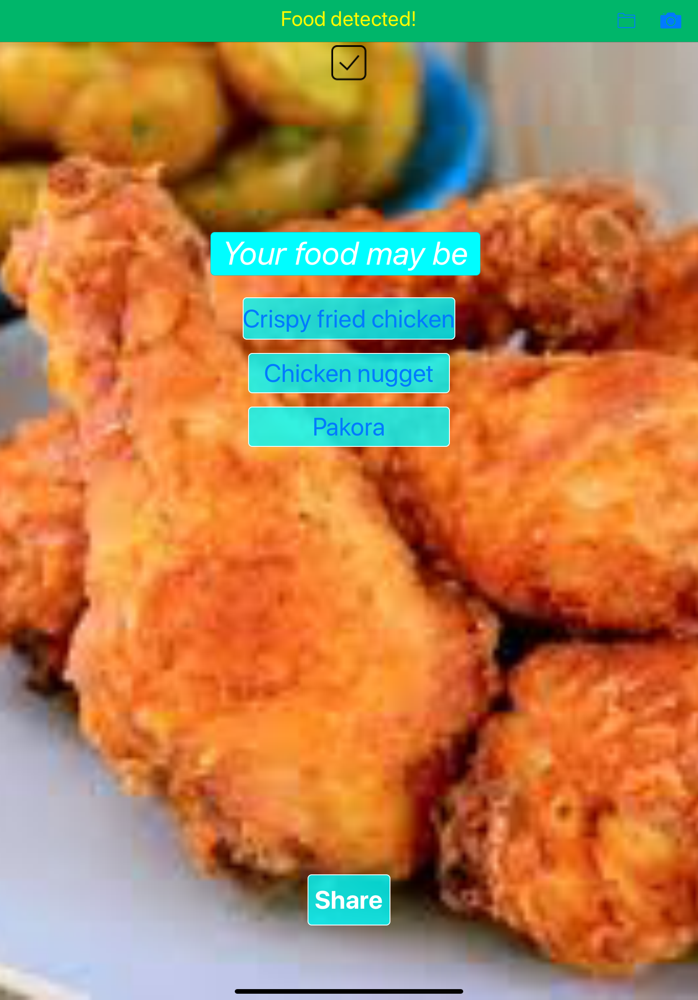
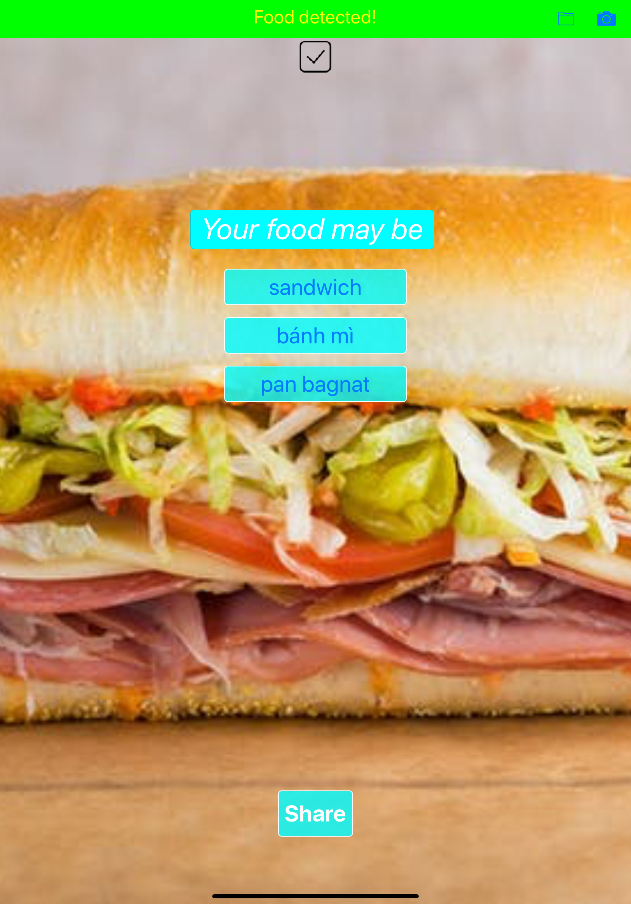
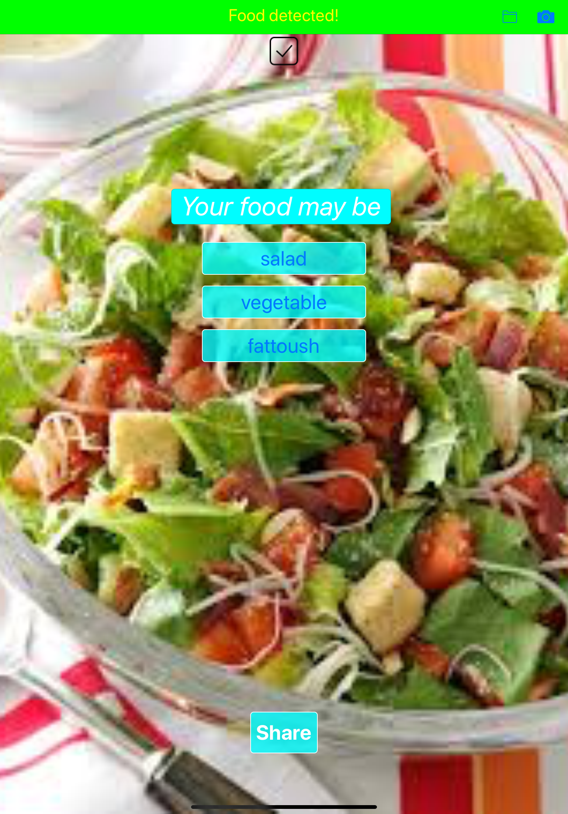

# SeeFood

    
    
    
    
    
    
    

SeeFood is a machine learning food app. Inspired by the classic app from the TV show Silicon Valley, It can not only classify "hotdog and not hotdog", but also find out the name of food in the photo you take, and display its nutrition information.  

It utilizes Google's image regnition services and its pre-trained neural net, and gets the nutrition data from nutritionix api. It uses Firebase as backend for user registration and login. 

Currently implementing real-time chat that allow users to send food photos to each other. Also developing the feature that will allow users to store the food nutrition information locally, so users can keep track of their diet and take care of their body.
