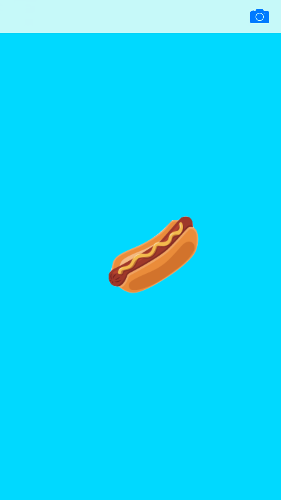
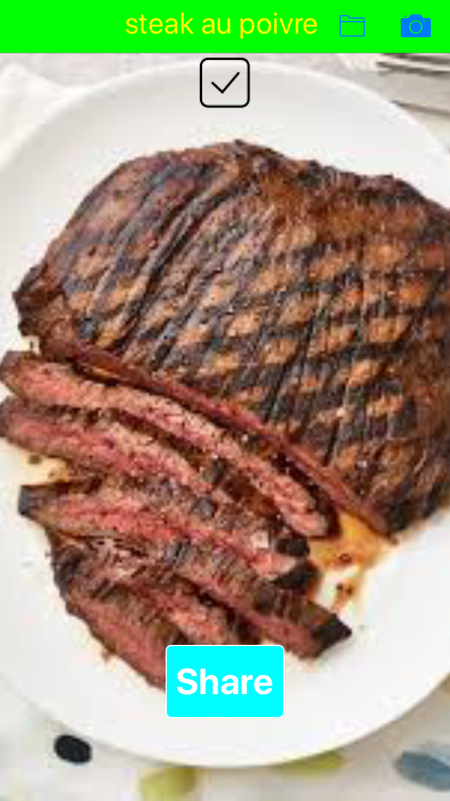
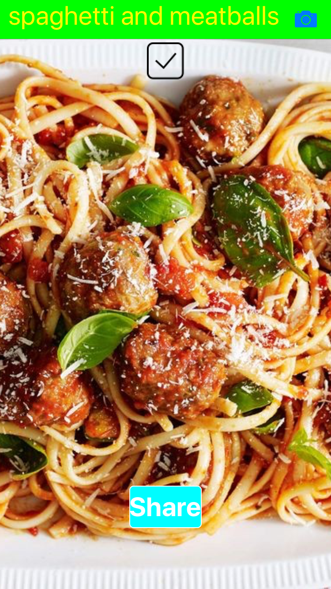
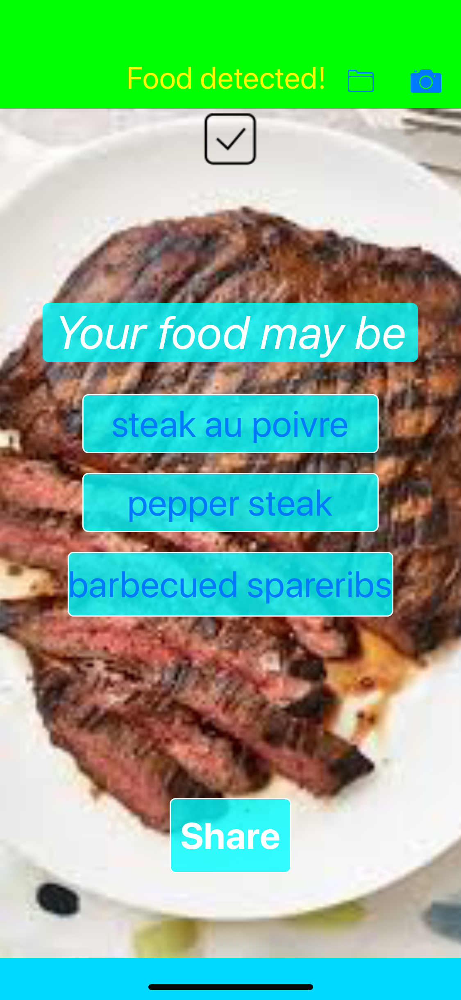

# SeeFood

    
    
    
    

SeeFood is a machine learning food app. Inspired by the classic app from the TV show Silicon Valley, It can not only classify "hotdog and not hotdog", but also find out the exact name of food in the photo you take. It utilizes IBM's image regnition services and its pre-trained neural net. Also, you can share the name of the food with your friends at the tap of a button.
